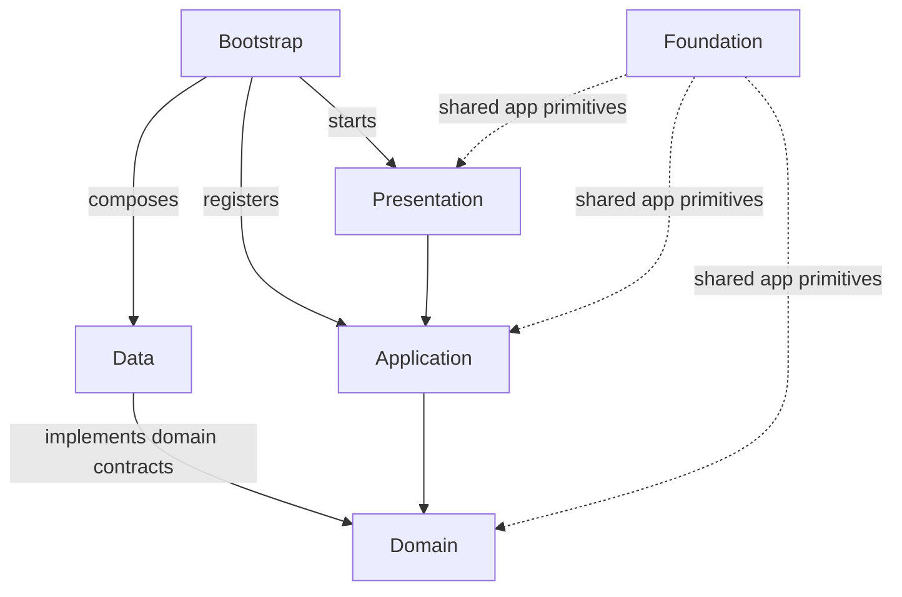

# Create an Application

`flueco_cli` creates a Flutter application from the Flueco repository's `example/` project and forwards Flutter project-generation options to `flutter create`.

Install the executable globally:

```shell
dart pub global activate flueco_cli
```

Create a project and choose its Flutter platforms:

```shell
flueco create my_app --org com.example --platforms android,ios,web
```

Use `--interactive` to be prompted for common project values. Flutter `create` options can be passed through; consult `flueco create --help` for the supported command options. Git and Flutter must be available on `PATH`. Use `--no-pub` to skip dependency resolution for the generated application.

The generated application begins from the repository's `example/` tree, while Flutter generates platform-specific project files. This is useful when the example's structure and package choices are a good fit; it is not a minimal template generator.

## Understand the generated structure

The example uses a layered, Clean Architecture-style organization. Treat it as a starting convention, not a framework restriction. The main runtime flow is:



### `lib/`

| Path | Responsibility | What belongs here |
| --- | --- | --- |
| `main.dart` | Process entrypoint | Read app configuration, construct the app-owned `Kernel`, await bootstrap, and start the root widget. Keep this file small. |
| `bootstrap/` | Composition root and integration wiring | The custom `Kernel`; Flueco service providers; app-specific implementations of adapter interfaces; Injectable modules and generated registration. This is where concrete packages are selected and connected. |
| `application/` | Application orchestration | Managers/stateful coordinators and app services that coordinate use cases or multiple layers, such as auth management, app-installation handling, navigation, and error handling. Avoid putting widget rendering here. |
| `domain/` | Feature rules and stable contracts | Entities, use cases, and contracts that describe capabilities the domain needs. Keep this layer independent of Flutter widgets, storage plugins, Dio, and route classes where practical. |
| `data/` | Infrastructure-facing implementations and models | Local/remote sources, database boxes/models, HTTP clients, request/response DTOs, and mapping into domain types. In the example, `sources/local/db` holds Hive-backed data and `sources/remote/http` holds REST clients and wire models. |
| `foundation/` | Shared app-level primitives | App configuration, reusable abstractions, assets, localization, converters, exceptions, extensions, and helpers used across features. Avoid turning this into a catch-all for feature-specific logic. |
| `presentation/` | User interface and navigation | Root app widget, screens, components, theme definitions, AutoRoute router, and route guards. Widgets should translate user interactions into application/view-model calls and render state. |

The example has more detailed subfolders: `application/managers` and `application/services`; `bootstrap/providers`, `bootstrap/implementations`, and `bootstrap/injections`; `domain/contracts`, `domain/entities`, and `domain/use_cases`; and `presentation/routing` plus `presentation/ui`. Under `data/sources`, the example separates `local` from `remote`, then organizes concrete DB and HTTP code by feature. Start with those boundaries, but simplify them for a smaller app.

### How a feature travels through the layers

For example, the auth screen calls its view model; the view model validates input and invokes `AuthUseCase`; the use case talks to Flueco authentication and navigation contracts; those contracts are backed by services/providers configured in `bootstrap/`. Remote HTTP clients and local database adapters live in `data/`. The dependency direction should point inward toward domain contracts: UI and data implementations depend on the rules/contracts, while bootstrap connects the chosen implementations.

Do not create a folder for every layer just because the sample has one. Add structure when a feature needs it, and keep related files discoverable. Generated files such as `.g.dart`, `.gr.dart`, and `injectable_service_provider.config.dart` are outputs of generators; edit their source annotations/modules and regenerate them instead of hand-editing generated output.

### Other project folders

- `assets/` contains application-owned static assets and translations; paths must also be declared in the Flutter section of `pubspec.yaml`.
- `test/` contains automated tests. Keep unit tests independent of platform plugins where possible; use widget/integration tests for Flutter and adapter behavior.
- `android/` and `ios/` contain platform projects produced/maintained by Flutter. Change them for native configuration, signing, permissions, and platform-specific setup.
- `.vscode/` contains workspace launch, test, and build-task configuration. It is useful to commit team-shared configurations, but review paths and local SDK settings after scaffolding.
- `pubspec.yaml` declares dependencies, SDK constraints, assets, and generator settings. Add or remove Flueco packages here as the application choices change.

The [`example/lib`](../../example/lib/) tree and [custom Kernel](../../example/lib/bootstrap/kernel.dart) are the authoritative references for this layout.

## Configure environment values

The example's [`.env.json`](../../example/.env.json) and [`.env.test.json`](../../example/.env.test.json) files are JSON files passed to Dart as **compile-time environment declarations** using `--dart-define-from-file`. They are not loaded from the device at runtime and do not behave like a general-purpose dotenv package. [`AppConfig.fromEnvironment()`](../../example/lib/foundation/config/app_config.dart) reads these keys with `String.fromEnvironment`:

| Define | Used for | Example value |
| --- | --- | --- |
| `ENVIRONMENT` | Selects `dev`, `staging`, `prod`, or `test` app configuration | `dev` |
| `APP_NAME` | App display/configuration name | `Flueco Example - Dev` |
| `SERVER_URL` | Base URL for the sample API client | `https://api.example.invalid` |
| `APP_KEY` | Example Hive encryption configuration | Use a generated local-only value; do not copy the repository's sample value |

Create a local JSON file using the keys your app reads, for example:

```json
{
 "ENVIRONMENT": "dev",
 "APP_NAME": "My App - Dev",
 "SERVER_URL": "https://dev-api.example.com"
}
```

Run Flutter with the file from the project root:

```shell
flutter run --dart-define-from-file=.env.json
```

The sample `AppConfig` defaults an absent `ENVIRONMENT` to `prod`, and an unknown value also falls back to `prod`. Set it explicitly to avoid accidentally running a development build with production behavior. Add corresponding `String.fromEnvironment` declarations to `AppConfig` when introducing new keys; adding a key to JSON alone does not make application code read it.

**Do not put production secrets in a dart-define JSON file.** Compile-time defines are embedded in the built application and can be extracted; they are not a secure secret store. The example's `.env.json`/`.env.test.json` demonstrate configuration wiring, not production key management. Keep real credentials out of source control and use an appropriate backend or platform secure-storage design for secrets. In particular, an encryption key embedded in an app cannot be treated as secret from a determined app user.

## Configure VS Code launch profiles

The example's [`.vscode/launch.json`](../../example/.vscode/launch.json) demonstrates how VS Code passes the JSON file to Flutter. A minimal app launch configuration looks like this:

```json
{
 "name": "Development",
 "request": "launch",
 "type": "dart",
 "program": "lib/main.dart",
 "args": [
  "--dart-define-from-file=.env.json"
 ]
}
```

Create additional launch profiles with a different `--dart-define-from-file` argument, such as `.env.staging.json`. Select the profile in VS Code's Run and Debug view before starting the app. Paths are relative to the Flutter project, so when you scaffold or move files, make sure the selected file exists at the configured path.

The example also defines `Test - Units` and `Test - Widgets` profiles that pass `.env.test.json` and separate `--tags` values. Its [`.vscode/settings.json`](../../example/.vscode/settings.json) supplies the test define file to test runs, and [`.vscode/tasks.json`](../../example/.vscode/tasks.json) includes build and code-generation tasks. If a test profile behaves differently from a normal run, check both the launch arguments and workspace test arguments to confirm the intended define file and test tag are being used.

Flutter CLI accepts the same file argument for builds, for example `flutter build web --dart-define-from-file=.env.json`. Configure the correct environment file for every run, test, and build profile; a VS Code launch setting does not automatically apply to CI or release builds.

After creation:

1. Inspect `pubspec.yaml`, `lib/bootstrap/`, `lib/foundation/config/`, the env JSON files, and platform folders.
2. Run `flutter pub get` if dependency resolution was skipped.
3. Replace sample identifiers and endpoints; remove sample integrations; keep secrets out of compile-time defines.
4. Select the intended VS Code launch profile or pass the intended define file explicitly from the CLI.
5. Run the app and its tests on a target platform before relying on the configuration in a release build.

The repository's [`example/`](../../example/) source is the reference for provider composition. Continue with [Bootstrap your application](first-app.md), [Kernel and bootstrap](../concepts/kernel-and-bootstrap.md), and the [architecture overview](../overview/architecture.md).
