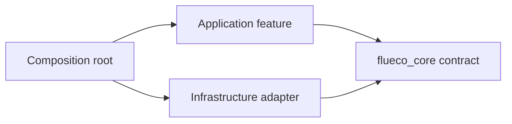

# Architecture

Flueco separates **what an application needs** from **which package provides it**. Core abstractions such as `LocalStorage`, `SecureStorage`, `HttpClient`, `Router`, and `EventHandler` describe capabilities. Adapter packages implement those capabilities, and `ServiceProvider`s register the implementations in an application container.

The intended dependency direction is:

Application features can depend on a core contract without importing a vendor library. The composition root is the place that knows both the feature and its selected adapter.

## The runtime pieces

- **`FluecoKernel`** coordinates startup. The `flueco` package provides a convenience subclass with default log and notification registries; the `flueco_core` kernel accepts registries explicitly.
- **`FluecoApp`** gives providers access to the shared resolver and injector during initialization.
- **`ServiceContainer`** combines registration and lookup. `GetItServiceContainer` is the repository's GetIt-backed implementation, but core defines the contract independently.
- **`ServiceProvider`** owns a feature's registrations and initialization. It declares prerequisite service types in `dependsOn()` and its provided types in `registered()`.
- **Adapters** bind contracts to concrete implementations. They may also require configuration objects or third-party instances to be registered before their provider can run.

These roles separate object construction from feature behavior: a view model or application service can request a contract, while the root selects which provider supplies it.

## Composition at startup

1. Initialize platform prerequisites that are outside Flueco's providers, such as plugin initialization required by the app.
2. Construct the service container and register prerequisite configuration/instances.
3. Select the service providers needed by the application.
4. Await `FluecoKernel.bootstrap()` before `runApp`.
5. Build the UI and resolve services through constructor injection, `ServiceResolver`, or the Flueco widget helpers where appropriate.

At a high level, bootstrap registers the app, log registry, and notification registry; calls provider registration; registers registry handlers; then initializes providers. Provider dependencies are declared as types, not package names. Correct declarations let the kernel defer providers until prerequisites are available. Because providers are supplied as a `Set`, application code should not rely on insertion order. Include all required providers/instances and test the complete bootstrap path; dependency declarations are not a replacement for explicit configuration.

The repo's [example bootstrap](../../example/lib/bootstrap/kernel.dart) is a useful reference for composing several real integrations. Its app initializes Flutter/Hive/localization prerequisites before bootstrapping Flueco, then wraps the root widget with `Flueco`.

## Follow one capability: storage

1. Application code asks for `LocalStorage`, the core capability contract.
2. The selected adapter package provides a `ServiceProvider` that registers a concrete implementation under that contract.
3. The application composition root registers adapter prerequisites and includes its provider in `serviceProviders`.
4. A consumer resolves `LocalStorage` from the container and uses its stable `get`, `set`, `remove`, and `contains` operations.

The `flueco_shared_preferences` adapter uses a registered `SharedPreferences` instance. `flueco_hive` implements `SecureStorage` instead and requires `HiveSecureStorageGetInstanceConfig`. These implementations do not have interchangeable security properties: choose the contract and backend appropriate to the data.

## Boundaries and trade-offs

- **Replaceability is at the contract boundary.** A consumer that imports Dio-specific types is coupled to Dio even if the service was resolved from Flueco.
- **Registration is explicit.** Installing a package does not automatically make its service available. Add its provider and satisfy its prerequisites.
- **Third-party APIs remain available where exported.** Adapter barrels re-export upstream packages for convenience; using those APIs directly is valid but creates a direct dependency on that library.
- **Not every feature belongs in core.** UI services, navigation, platform plugins, and optional app patterns are provided by separate packages so the foundation can remain reusable.
- **Test the composition root.** Unit tests can substitute contract implementations, while at least one integration/widget test should verify that the selected providers and their prerequisites bootstrap together.

For the API-level details, continue to [Kernel and bootstrap](../concepts/kernel-and-bootstrap.md), [Service providers](../concepts/service-providers.md), and [Dependency injection](../concepts/dependency-injection.md). Browse the [package catalog](../reference/packages.md) for adapter prerequisites and the [ecosystem overview](ecosystem.md) for package selection.
