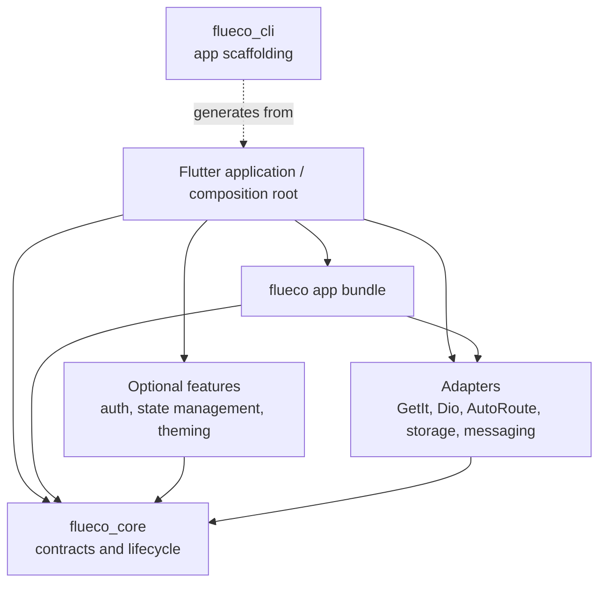

# The Flueco Ecosystem

Flueco is a toolkit for composing Flutter applications from shared service contracts and replaceable implementations. It is not one monolithic runtime: the repository contains a foundation, adapters for common infrastructure, optional application features, and a CLI that scaffolds an example application.

The main design idea is that application code should ask for a capability such as `HttpClient` or `LocalStorage`, while a composition root decides which implementation provides it. This keeps vendor-specific choices near application startup and makes them easier to replace, configure, and test.

## Package layers

| Layer | Responsibility | Packages |
| --- | --- | --- |
| Foundation | Defines contracts, lifecycle, and shared behavior | `flueco_core` |
| App bundle | Provides a convenient Flutter-oriented set of exports and user-facing services | `flueco` |
| Infrastructure adapters | Connect core contracts to concrete libraries | `flueco_get_it`, `flueco_dio`, `flueco_auto_route`, `flueco_hive`, `flueco_shared_preferences`, `flueco_messaging` |
| Optional application features | Add higher-level capabilities | `flueco_auth` and its strategy/integration packages; `flueco_state_management`; `flueco_theming` |
| Tooling | Generates a starter app from the repository example | `flueco_cli` |

The dependency direction is intentional: adapters depend on core contracts, while core does not need to depend on a specific adapter. Application composition brings the selected pieces together.

This diagram describes the architectural roles, not a requirement to import every box. In particular, `flueco` already re-exports core and selected adapters, but auth, state management, and the CLI are separate dependencies.

## What is a service?

In Flueco, a service is an application capability made available through the service container. `ServiceResolver` exposes lookup, `ServiceInjector` exposes registration, and `ServiceContainer` combines both. A `ServiceProvider` groups registrations and any initialization for a feature or adapter.

For example, the core `LocalStorage` contract describes string reads, writes, removal, and containment. `flueco_shared_preferences` supplies an implementation. The app registers the adapter provider and its prerequisite `SharedPreferences` instance during startup; consumers can then depend on `LocalStorage` rather than directly constructing the plugin wrapper. This is dependency inversion at the application composition boundary, not automatic plugin discovery.

## Choosing a starting point

- Choose `flueco` when building a normal Flutter app and you want the bundle's selected adapters, default registries, and app-facing services.
- Choose `flueco_core` directly when you need the contracts and lifecycle without the bundle's default UI and infrastructure choices.
- Add an adapter when you need a concrete implementation for a core contract. Include the adapter's prerequisite instances/configuration as well as its provider.
- Add `flueco_auth` with the strategy packages you need, and add `flueco_state_management` separately if using its Provider-based view-model APIs.
- Use `flueco_cli` when the repository example is a suitable starter; it is not a runtime dependency of the generated app.

The [package catalog](../reference/packages.md) lists each package and whether it is re-exported by `flueco`. The [architecture overview](architecture.md) follows a service through registration and use.

Package versions and SDK constraints can change independently. Consult [compatibility](../reference/compatibility.md) and the package manifests before choosing versions.
